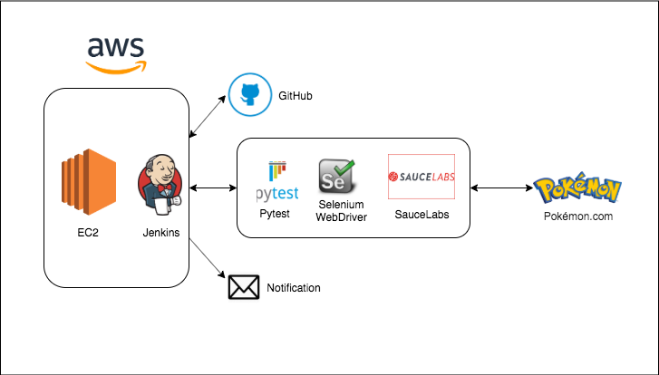

## Pokemon UI Test Framework Architecture

### Story:
As a Potential Pokemon SDET, I would like to setup UI Automated testing for the Pokemon.com/US website using Jenkins, Robot Framework, Selenium WebDriver and SauceLabs, in order to verify that there are no bugs on the website.

### Acceptance Criteria:
- [x] AWS account with EC2 instance running.
- [x] Jenkins and RobotFramework installed and configured.
- [x] Working Jenkinsfile to Checkout, Execute test and Report failures.
- [x] UI Tests written in Robot Framework.
- [x] Linked SauceLabs account to executed and record UI Test.
- [x] Jenkins job to run nightly and email failures.
- [x] Multi-branch Jenkins job triggered automatically, using github webhook, when new source code is checked in.

### Definition of Done
- [x] UI test to verify all Pokemon.com Header Buttons.
- [x] UI test to verify Pokedex Search feature.
- [x] UI tests passes and Runs on SauceLabs.
- [x] Source code checked in

The Nightly Jenkins job can be found here.

http://3.133.109.139:8080/

The SauceLabs Replay can be seen below.

